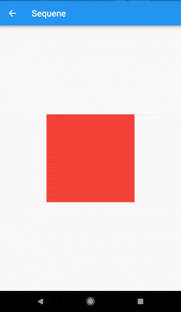
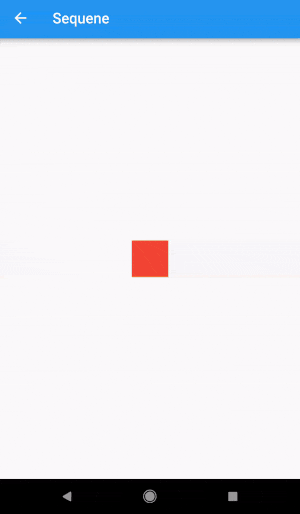

# flutter_sequence_animation

### Features
- No need to use intervals and calculate percentages for your total animation time. 
- Animate the same variable with multiple animatables!
- You only need one AnimationController
- Intuitive and easy to use interface

# Installation


```
dependencies:
  flutter_sequence_animation: "^4.0.0-nullsafety"
```


then
```
$ flutter packages get
```
then
```
import 'package:flutter_sequence_animation/flutter_sequence_animation.dart';
```

# Demo

 

# Code

_The Staggered Animation example from [here](https://flutter.io/animations/staggered-animations/) is
207 lines of [code](https://raw.githubusercontent.com/flutter/website/master/_includes/code/animation/basic_staggered_animation/main.dart) .
The same animation with this package is 128 lines of [code](https://github.com/Norbert515/flutter_sequence_animation/blob/master/example/lib/staggered_animation_replication.dart).
It is also much easier to read and edit._

#### You specify a sequence of animatables like this:
``` dart
    sequenceAnimation = new SequenceAnimationBuilder()
      .addAnimatable(
          animatable: new ColorTween(begin: Colors.red, end: Colors.yellow),
          from:  const Duration(seconds: 0),
          to: const Duration(seconds: 2),
          tag: "color"
        ).addAnimatable(
          animatable: new ColorTween(begin: Colors.yellow, end: Colors.blueAccent),
          from:  const Duration(seconds: 2),
          to: const Duration(seconds: 4),
          tag: "color",
          curve: Curves.easeOut
        ).addAnimatable(
          animatable: new ColorTween(begin: Colors.blueAccent, end: Colors.pink),
          //  animatable: new Tween<double>(begin: 200.0, end: 40.0),
          from:  const Duration(seconds: 5),
          to: const Duration(seconds: 6),
          tag: "color",
          curve: Curves.fastOutSlowIn
        ).animate(controller);
```
In this case only the color is animated but you can add as many different properties to the sequence as you'd like to.
The only restriction is that animations with the same tag can not overlap and need to be ordered.

#### Now you can access the resulting animation from anywhere in your code with
```dart
sequenceAnimation["color"]
```
This animation is a composition of all animatables you passed in with the same tag.

#### Example usage of this example:
```dart
new AnimatedBuilder(
          builder: (context, child) {
            return new Center(
              child: new Container(
                color: sequenceAnimation["color"].value,
                height: 200.0,
                width: 200.0,
              ),
            );
          },
          animation: controller,
        ),
```

#### The animation duration is set automatically (don't change the duration of the controller yourself).

### Sepcial thanks to [Simon Lightfoot](https://github.com/slightfoot) for the help!


## Getting Started

For help getting started with Flutter, view our online [documentation](https://flutter.io/).

For help on editing package code, view the [documentation](https://flutter.io/developing-packages/).
